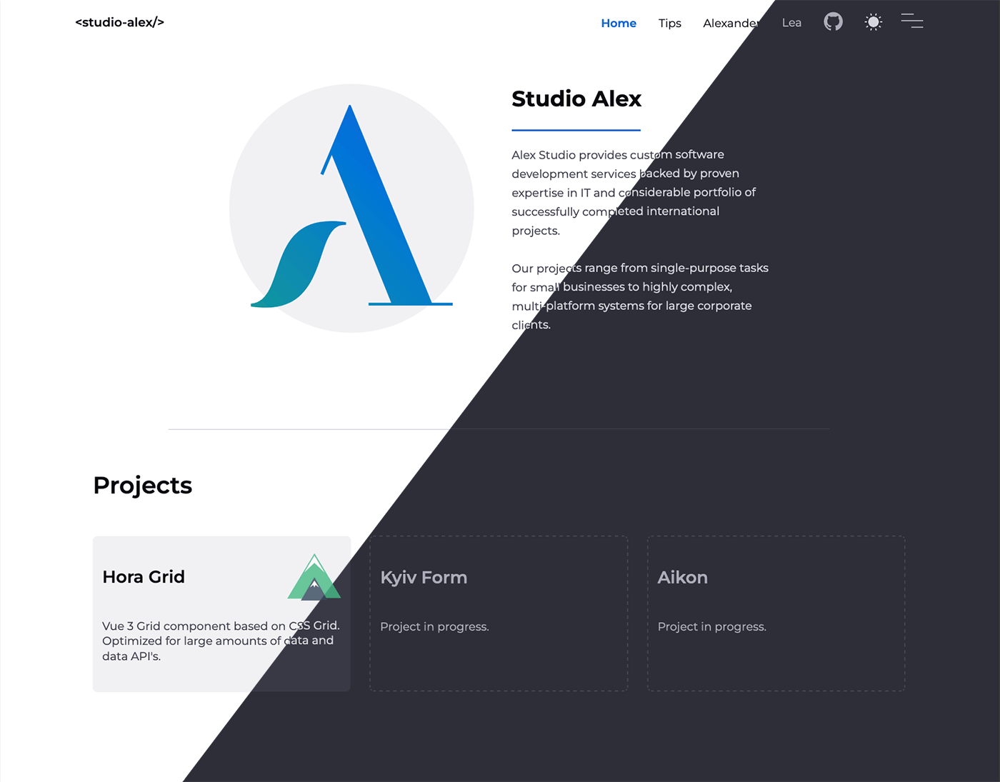

# Welcome to [StudioAlex](https://www.studioalex.dev/)

This is the code base for our web presence based on [Astro](https://astro.build) and [Netlify CMS](https://www.netlifycms.org/). While Astro is one of the best decisions we've made, Netlify CMS is currently the best choise to stay independent from other services. We are always open to suggestions.
You are also welcome to use this project as a base for your presentation.

## 🚀 Why

We wanted to have a simpler approach to our web presence than current frameworks such as 11ty or Hugo have. Astro JS offers exactly that. In the second step we separate the content to facilitate adjustments. We have achieved this with Netlify CMS. The advantage of Netlify CMS is that no database or third party service is needed to maintain or enter the content. Netlify CMS creates the content as Markdown files, which remain in the project repository. It simply provides an intuitive and easily configurable interface for entering and maintaining content. These are transferred into the system via merge requests.

## Actually this template can provide

-  Startpage with hero, project / showcases and technology overview section.
-  A blog service where every post has the correct meta information.
- A personal page
- and a page about your personal hardware and application you use.
- Dark and Light mode
- Easy to configure throw json data files.

We are open for any ideas or improvement.

## 👀 Want to learn more about Astro JS?

Feel free to check [Astro documentation](https://docs.astro.build) or jump into Astro [Discord server](https://astro.build/chat).
